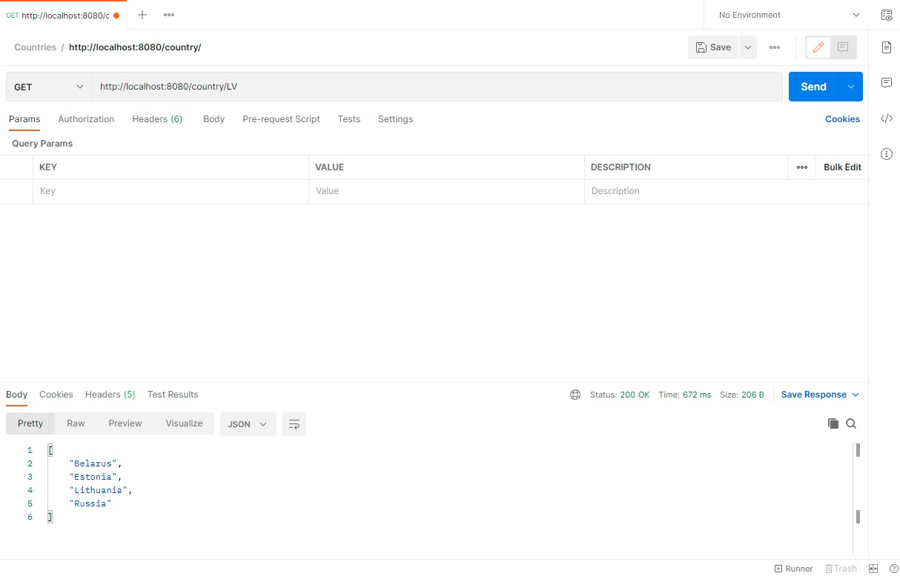

# Countries
This repository contains working code sample which accept a country code and provide a list of all border countries.
# Guidelines
Clone this repository.

To launch Maven Spring Boot application open in command prompt project directory and use command "./mvnw spring-boot:run" in command line.

In web browser start using URL http://localhost:8080/country/{code}. Replace {code} with country code and get border countries list.

You can use also Postman for better api testing:

